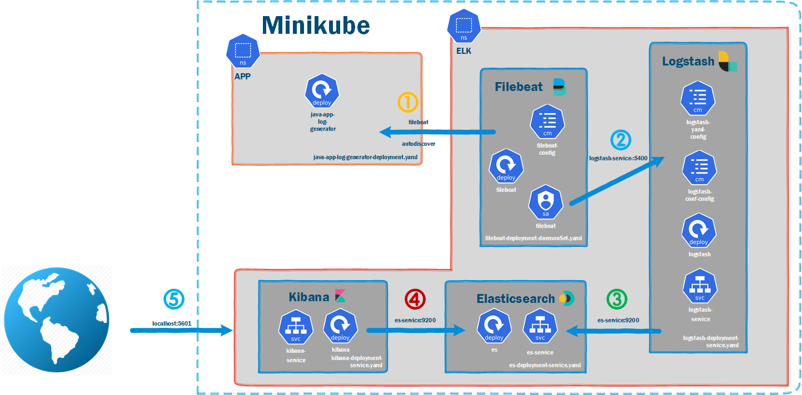

# How to Configure Kubernetes Resource Quotas? 
## Video Topics  
- Hands-on Demo Environment    
- What is Kubernetes Resource Quotas?    
- Why do We Need Kubernetes Resource Quotas?    
- How to Configure Resource Quotas in Namespace?   
- How to Apply Resource Quotas in Pod?   


## Hands-on Demo Environment   
- OS version - Ubuntu 22.04 LTS     
  - `lsb_release -a`     
- Docker Version - 20.10.16     
  - `docker version`        
- Minikube version - v1.25.2   
  - `minikube version`      
- Docker Images are from  [How to Install Elasticsearch, Kibana,Logstash, Filebeat and Java App on Minikube](https://youtu.be/vN0BrVvmUxc)     


## What is Kubernetes Resource Quotas? 
- Quota Types
  - Compute Resource Quota 
    - Requests define the minimum amount of resources  
    - Limits define the max amount of resources  
  - Storage Resource Quota
  - Object Count Quota 
<image src="./images/resource.png" width="80%">     


## Why do We Need Kubernetes Resource Quotas?   
- Teams share one Kubernetes cluster
   - If insufficient memory resources are allocated, the application would be Out Of Memory (OOM) and crash.   
   - Without proper planning, the low-priority Pod used too many resources, which could lead to critical Pods outage.
- A Pod is stuck in Pending   
     - kubectl get nodes 
## How to Configure Resource Quotas in Namespace?  

- System Overview   
 [How to Install Elasticsearch, Kibana,Logstash, Filebeat and Java App on Minikube](https://youtu.be/vN0BrVvmUxc)         
   

- ResourceQuota
```   
apiVersion: v1
kind: ResourceQuota
metadata:
  name: mem-cpu-app
spec:
  hard:  
    requests.cpu: "1"  
    requests.memory: 1Gi  
    limits.cpu: "2"  
    limits.memory: 2Gi   
    persistentvolumeclaims: "4"
    pods: "4"
    replicationcontrollers: "4"
    secrets: "4"
    services: "1"
```   

- LimitRange
```
apiVersion: v1
kind: LimitRange
metadata:
  name: mem-limit-range
spec:
  limits:
  - default:
      memory: 512Mi
    defaultRequest:
      memory: 256Mi
    type: Container
```   
- kubectl apply -f quota-limit-range.yaml   
- kubectl get resourcequota mem-cpu-app --namespace=app --output=yaml 
- kubectl get limitrange mem-limit-range --namespace=app --output=yaml   

## How to Apply Resource Quotas in Pod?  
### Pod Resource Lower Namespace Configuration     
```    
apiVersion: apps/v1
kind: Deployment
metadata:
  labels:
    node.type: java-app-log-generator
  name: java-app-log-generator
  namespace: app
spec:
  replicas: 1
  selector:
    matchLabels:
      node.type: java-app-log-generator
  template:
    metadata:
      labels:
        node.type: java-app-log-generator
    spec:
      containers:
        - env:
            - name: RATE
              value: "10"
          name: java-app-log-generator    
          image: febbweiss/java-log-generator:latest
          resources:
            requests:
              memory: "64Mi"
              cpu: "250m"
            limits:
              memory: "128Mi"
              cpu: "500m"
```    
- kubectl apply -f java-app-log-generator-deployment-v1.yaml

### Pod Resource over Namespace Configuration

```    
apiVersion: apps/v1
kind: Deployment
metadata:
  labels:
    node.type: java-app-log-generator
  name: java-app-log-generator
  namespace: app
spec:
  replicas: 1
  selector:
    matchLabels:
      node.type: java-app-log-generator
  template:
    metadata:
      labels:
        node.type: java-app-log-generator
    spec:
      containers:
        - env:
            - name: RATE
              value: "10"
          name: java-app-log-generator    
          image: febbweiss/java-log-generator:latest
          resources:
            requests:
              memory: "1024Mi"
              cpu: "3"
            limits:
              memory: "1024Mi"
              cpu: "3"
```   
- kubectl delete -f java-app-log-generator-deployment-v1.yaml 
- kubectl apply -f java-app-log-generator-deployment-v2.yaml  
- kubectl get pods --namespace=app 
